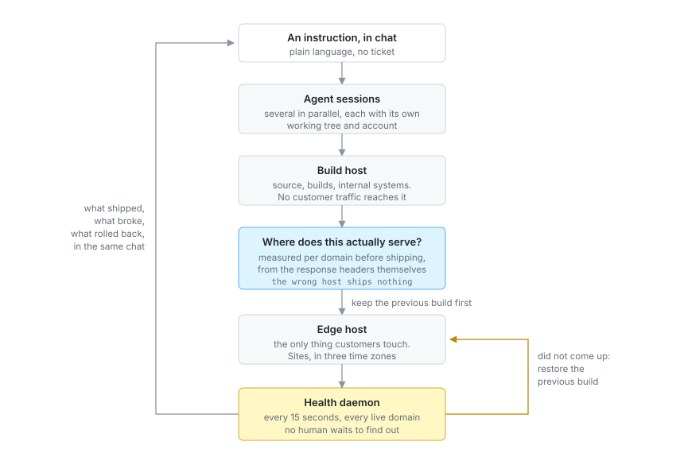

  

**AI product & software engineering studio.**

We design, build and operate AI systems, platforms and SaaS,
from first prototype to production scale.

[**intframe.com**](https://intframe.com) · [Engineering blog](https://intframe.com/blog) · [Contact](https://intframe.com/contact)

---

## The homepage, in motion

Every chapter below is scroll-driven, rendered live in the browser, and generated from real production data. Scroll it yourself at [intframe.com](https://intframe.com).

| | |
|---|---|
|  |  |
| **GROUND CONTROL.** A low-orbit flight over our four bases, ending in a target lock on our origin rack. | **THE MACHINE.** A pick-and-place head assembles all 53 production services onto a board. Every block's height is that service's real memory footprint. |

**THE RECEIPT.** A thermal printer prints the studio, line by line. Total due: 0.00.

## The fleet, measured live

Current as of today:

| Metric | Value |
|---|---|
| Ventures operated | **9** |
| Production services | **53** |
| Sites served | **45** |
| Databases | **18** |
| Rented backbone | **0**. Everything runs on our own metal |
| AI coding spend | **$91.3K** over 104 days, [ranked worldwide](https://www.viberank.app/profile/aron-intframe) |
| Tokens burned | **70.8B** across Claude Code and Codex CLI |

Seoul · Nha Trang · Singapore · Falkenstein. Three time zones, every day of the year.

Usage is submitted to [viberank](https://www.viberank.app/profile/aron-intframe), which validates it server-side and verifies the submitting account.

## Open source

Extracted from production, each paired with a write-up on the [blog](https://intframe.com/blog):

| Repository | What it is | On npm |
|---|---|---|
| [`thermal-receipt`](https://github.com/intframe/thermal-receipt) | Scroll-driven thermal receipt printer UI component (React) |  |
| [`scroll-rig`](https://github.com/intframe/scroll-rig) | Scroll-driven three.js chapter patterns: camera beats, staggered assembly, adaptive quality governor | |
| [`scroll-qa`](https://github.com/intframe/scroll-qa) | Playwright toolkit for QA-ing scroll- and animation-heavy sites | |
| [`usage-recover`](https://github.com/intframe/usage-recover) | Recovers deleted Claude Code and Codex usage history from public leaderboard aggregates |  |

## How we ship

An instruction arrives in chat and comes back as a deployment, or as a rollback with an explanation. The loop below is the actual one, not an aspiration.

Two of those steps exist because we got them wrong first.

The gate measures which host serves a domain instead of trusting a registry, after a deploy went to a machine that had stopped serving it and the change quietly did nothing. The previous build is preserved before the new one is made, rather than after, which is the only ordering where a rollback still has something to roll back to.

- Every product we design, we also run in production. Hosting, support, upgrades, the 3 a.m. pages.
- The 3D chapters above are baked from the live fleet topology, not mocked up.
- Secret scanning gates every public push. Playwright audits every scroll beat of our own site.

## Work with us

We take on a small number of engagements: AI products, intelligent automation, platforms and the business systems behind them.

**[hello@intframe.com](mailto:hello@intframe.com)** · [intframe.com/contact](https://intframe.com/contact)

<!-- oss-agent:contributions:start -->

### Merged upstream

Fixes we shipped into other people's projects, newest stars first.

| Project | Stars | What we fixed |
|---|---|---|
| [`diegosouzapw/OmniRoute`](https://github.com/diegosouzapw/OmniRoute) | 54,159 | [fix(services): fall back to ss and netstat when lsof is absent](https://github.com/diegosouzapw/OmniRoute/pull/10459) |
| [`apexcharts/apexcharts.js`](https://github.com/apexcharts/apexcharts.js) | 15,133 | [fix: keep millisecond resolution when x is a Date on a datetime axis](https://github.com/apexcharts/apexcharts.js/pull/5277) |
| [`junhoyeo/tokscale`](https://github.com/junhoyeo/tokscale) | 5,144 | [feat: add ccusage import format](https://github.com/junhoyeo/tokscale/pull/1128) |

<!-- oss-agent:contributions:end -->
