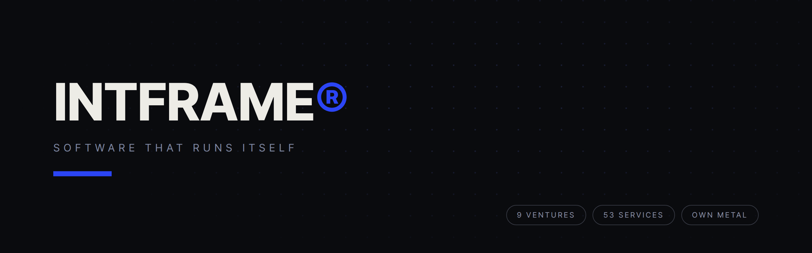
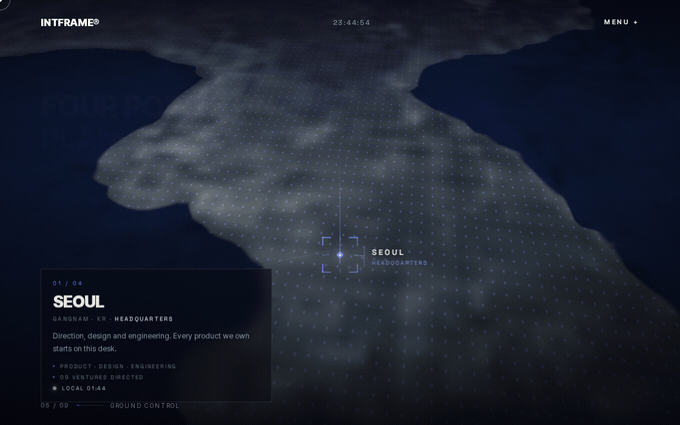
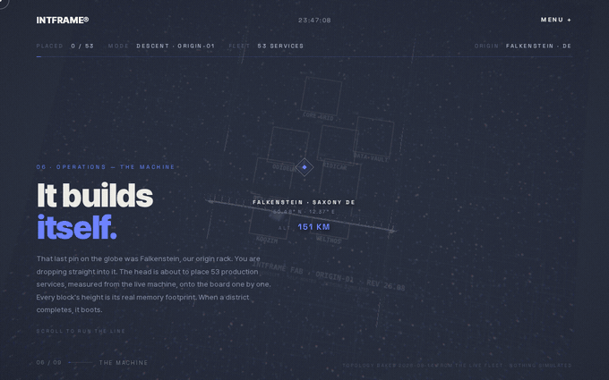
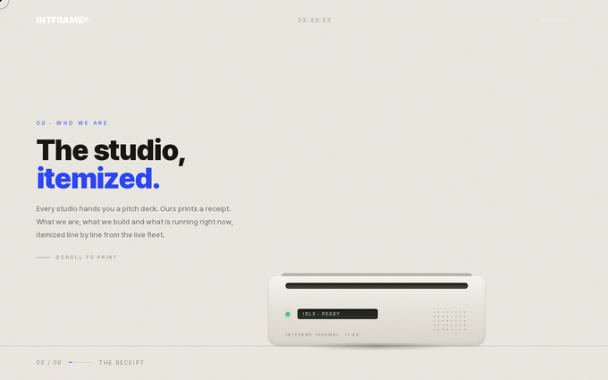

  

**AI product & software engineering studio.**

We design, build and operate AI systems, platforms and SaaS,
from first prototype to production scale.

[**intframe.com**](https://intframe.com) · [Engineering blog](https://intframe.com/blog) · [Contact](https://intframe.com/contact)

---

## The homepage, in motion

Every chapter below is scroll-driven, rendered live in the browser, and generated from real production data. Scroll it yourself at [intframe.com](https://intframe.com).

| | |
|---|---|
|  |  |
| **GROUND CONTROL** — a low-orbit flight over our four bases, ending in a target lock on our origin rack. | **THE MACHINE** — a pick-and-place head assembles all 53 production services onto a board. Every block's height is that service's real memory footprint. |

**THE RECEIPT** — a thermal printer prints the studio, line by line. Total due: 0.00. It pays for itself.

## The fleet, measured live

These are production numbers, not marketing copy:

| Metric | Value |
|---|---|
| Ventures operated | **9** |
| Production services | **53** |
| Sites served | **45** |
| Databases | **18** |
| Rented backbone | **0** — everything runs on our own metal |
| AI coding spend | **$91.3K** over 104 days — [ranked worldwide](https://www.viberank.app/profile/aron-intframe) |
| Tokens burned | **70.8B** across Claude Code and Codex CLI |

Seoul · Nha Trang · Singapore · Falkenstein. Three time zones, every day of the year.

Our usage is submitted to [viberank](https://www.viberank.app/profile/aron-intframe), which validates every submission server-side — token math, cost-per-token ratio, date sanity, and verifies the submitting account. Nothing here is self-reported.

## Open source

Extracted from production, each paired with a write-up on the [blog](https://intframe.com/blog):

| Repository | What it is | On npm |
|---|---|---|
| [`thermal-receipt`](https://github.com/intframe/thermal-receipt) | Scroll-driven thermal receipt printer UI component (React) |  |
| [`scroll-rig`](https://github.com/intframe/scroll-rig) | Scroll-driven three.js chapter patterns — camera beats, staggered assembly, adaptive quality governor | — |
| [`scroll-qa`](https://github.com/intframe/scroll-qa) | Playwright toolkit for QA-ing scroll- and animation-heavy sites | — |

## How we build

- **We operate what we ship.** Every product we design, we also run in production — hosting, support, upgrades, the 3 a.m. pages. It changes how you engineer.
- **Real data over mockups.** The 3D chapters above are baked from the live fleet topology.
- **Machines enforce quality.** Secret scanning gates every public push. Playwright audits every scroll beat of our own site.

## Work with us

We take on a small number of engagements: AI products, intelligent automation, platforms and the business systems behind them.

**[hello@intframe.com](mailto:hello@intframe.com)** · [intframe.com/contact](https://intframe.com/contact)
